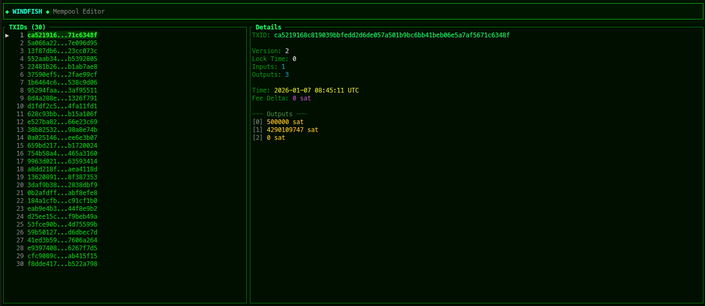

# Windfish
A Rust library for reading and writing Bitcoin Core `mempool.dat` files.



## Features

- Parse V1 mempool.dat files (non-XOR'd)
- Serialize mempool data back to bytes
- Access transactions, fee deltas, and unbroadcast TXIDs

## Usage

```rust
use windfish::MempoolSerde;
use std::path::Path;

let mempool = MempoolSerde::new(Path::new("mempool.dat")).unwrap();
println!("Transactions: {}", mempool.txs.len());
```

## TUI

A terminal interface for exploring mempool.dat files.

```bash
cargo run -p windfish-tui -- <path-to-mempool.dat>
```

## License

MIT
