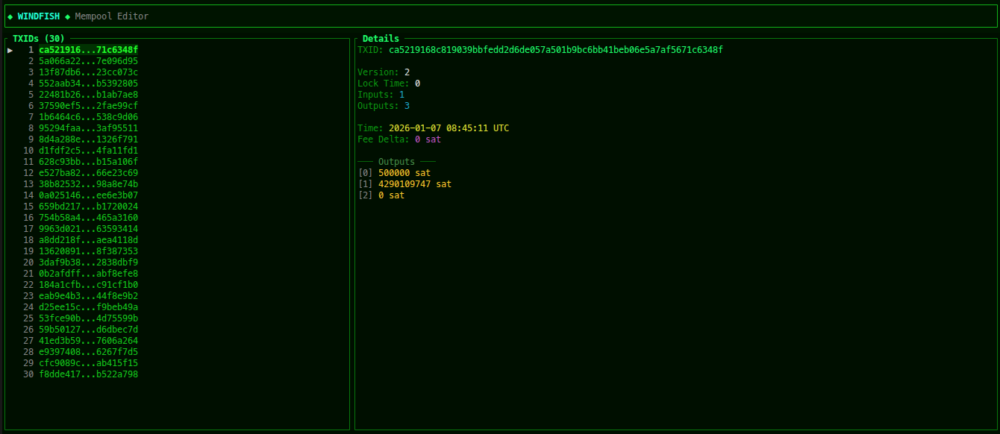

# Windfish
A Rust library for reading and writing Bitcoin Core `mempool.dat` files.

## Features

- Parse V1 mempool.dat files (non-XOR'd)
- Serialize mempool data back to bytes
- Access transactions, fee deltas, and unbroadcast TXIDs

